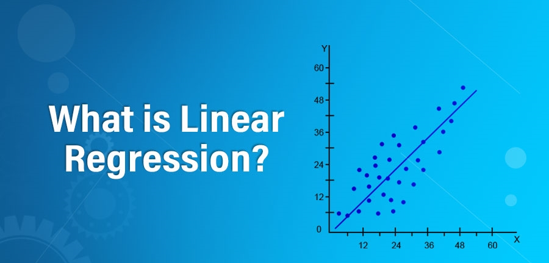
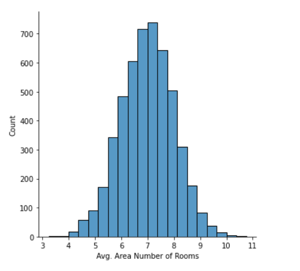
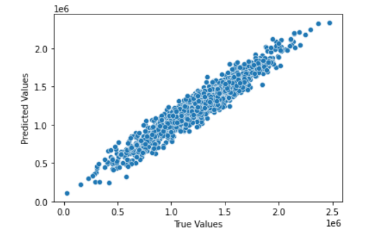

# House Price Prediction Model (USA) Using Linear Regression


## Linear Regression?


Linear Regression is a **machine learning algorithm** based on **supervised learning**. It performs a regression task. Regression models a target prediction value based on independent variables. Linear regression is used to predict the value of a variable based on the value of another variable. The variable you want to predict is called the dependent variable. The variable you are using to predict the other variable's value is called the independent variable :wink:.

Linear regression performs the task to predict a dependent variable value (y) based on a given independent variable (x). So, this regression technique finds out a linear relationship between x (input) and y(output). Hence, the name is Linear Regression. You can find a more formal definition on [Wikipedia](https://en.wikipedia.org/wiki/Linear_regression).


## About Dataset - 

### Dataset Description
This file contains some information about a bunch of houses in regions of the United States. The data contains the following fields:

- *Avg. Area Income* : Avg. Income of residents of the city house is located in.
- *Avg. Area House Age* : Avg Age of Houses in same city
- *Avg. Area Number of Rooms* : Avg Number of Rooms for Houses in same city
- *Avg. Area Number of Bedrooms* : Avg Number of Bedrooms for Houses in same city
- *Area Population* : Population of city house is located in
- *Price* : Price that the house sold at
- *Address* : Address for the house

The dataset is available publicly on *Kaggle* Website. You can access or download the dataset from [here](https://github.com/Deeshu-Jain/House-Price-Prediction-Model-USA-Using-Linear-Regression/blob/main/USA_Housing.csv), or directly from the[Kaggle](https://www.kaggle.com/datasets/aariyan101/usa-housingcsv) website.


## Content
**House Price Prediction Model - Using Linear Regression** 


Predicting house prices can help to determine the selling price of a house of a particular region and can help people to find the right time to buy a home.

Exploratory Data Analysis is performed on the pre-cleaned dataset. Then a Linear Regression model, a supervised machine learning model, is trained and, house prices are predicted. A model that allows us to put in a few features of a house and returns back an estimate of what the house would sell for.


## Instructions for Running Python Notebooks Locally
 
 - Install the required libraries in your Virtual Environment.

 - Run notebooks as usual by using a jupyter notebook server, Vscode etc.


## Libraries to Install
    
:white_check_mark: **Numpy** : [Numpy Installation](https://numpy.org/install/)

:white_check_mark: **Pandas** : [Pandas Installation](https://pandas.pydata.org/docs/getting_started/index.html)

:white_check_mark: **Matplotlib** : [Matplotlib Installation](https://matplotlib.org/stable/users/getting_started/)

:white_check_mark: **Seaborn** : [Seaborn Installation](https://seaborn.pydata.org/installing.html)

:white_check_mark: **Scikit-learn** : [Sklearn Installation](https://scikit-learn.org/stable/install.html#)


## Project Notebook

You can install Jupyter Notebook Environment from [here](https://jupyter.org/install) or through the [Anaconda Distribution](https://www.anaconda.com/products/distribution) or, can even use any IDE you like.

You can access the **Project Notebook** from [here](https://github.com/Deeshu-Jain/House-Price-Prediction-Model-USA-Using-Linear-Regression/blob/main/House%20Price%20Prediction%20Model%20(USA).ipynb).


## Code Snippet

```python
#Splitting the data into training and testing data
from sklearn.model_selection import train_test_split
x_train,x_test,y_train,y_test = train_test_split(x, y, test_size=0.3)
```


## Screenshots
Includes Screenshots of Some Visualization Figures, Model Working







## Support My Work :wink:
You can feel free to comment on my projects, find the bugs :mag_right: or tell me what your thoughts about my coding, analysis and insight. You can also take some codes away if you think some of them can be useful for your projects :computer:. 
If you liked what you saw :blush:, want to have a chat with me about the portfolio, work opportunities, or collaboration, shoot :gun: an email at djjain844@gmail.com.

You can check out my portfolio here :v:.
